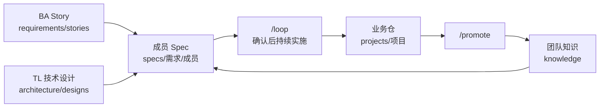

# Saber

Saber 是团队共享 Skills、需求证据、成员实施 Spec 与当前知识的 AI 工作空间。

## 知识图谱



BA 或 TL 提交并推送 Story/技术设计后，成员在业务仓通过 `/loop` 指定需求。Saber 保留每个成员自己的 Spec、Tickets、决策和结果；完成后的可复用结论再通过 `/promote` 更新团队知识。

## 快速开始

前提：Node.js 20+。

```bash
mkdir team-workspace
cd team-workspace
npm install -g @codehero0x0/saber
saber setup
```

目录名由团队自行决定。首次 `setup` 会创建：

```text
requirements/stories/   BA Story
architecture/designs/   架构师/TL 技术设计
knowledge/              当前团队知识
specs/                  各成员的实施 Spec 产物
skills/                 Saber 自有 Skills
projects/               前后端等业务仓
.saber/                 本地运行状态，不提交
```

在 `saber.yaml` 配置业务仓：

```yaml
schemaVersion: 2

projects:
  - name: frontend
    path: projects/frontend
    repository: git@github.com:your-org/frontend.git
  - name: backend
    path: projects/backend
    repository: git@github.com:your-org/backend.git
```

再次执行 `saber setup`，缺失的仓库会被 clone 到 `projects/<name>`。团队 Skills 会链接到每个业务仓的 `.agents/skills`、`.claude/skills` 和 `.opencode/skills`。

## 配置 Skills

Saber 支持多个上游来源。默认从 Matt Pocock 的 `main` 更新工程 Skills，并从固定 Ponytail 版本分发复杂度审查 Skills：

```yaml
skills:
  sources:
    - id: mattpocock
      repository: https://github.com/mattpocock/skills
      ref: main
      include:
        - grill-me
        - grilling
        - tdd
        - grill-with-docs
        - to-spec
        - to-tickets
        - implement
        - domain-modeling
        - code-review
    - id: ponytail
      repository: https://github.com/DietrichGebert/ponytail
      ref: v4.8.4
      include:
        - ponytail-review
        - ponytail-audit
        - ponytail-debt
```

修改配置后重新执行：

```bash
saber setup
```

不同来源不能提供同名 Skill；发生冲突时 Setup 直接失败，不会静默覆盖。

## 使用 Loop 完成需求

### 1. 提交需求证据

BA 将 Story 放入 `requirements/stories/`，架构师或 TL 将技术设计放入 `architecture/designs/`。来源文件必须已经提交，并包含在 `saber.yaml` 配置的证据分支中：

```yaml
loop:
  evidenceBranch: origin/main
  maxIterations: 8
  maxNoProgressIterations: 3
  maxMinutes: 60
```

### 2. 在业务仓启动

```bash
cd projects/backend
```

在 AI 工具中调用：

```text
/loop STORY-123
```

也可以指定相对团队工作空间的路径：

```text
/loop requirements/stories/STORY-123.md
```

Loop 会依次完成：

```text
grill → 人工确认 → to-spec → 人工确认 → to-tickets → 人工确认
      → implement/tdd → 验证 → ponytail-review → code-review → 完成
```

当前只有一个待确认点时，成员直接回复：

```text
确认
```

确认 Tickets 后，Loop 才能修改业务代码。验证结果必须对应最新工作区内容，否则不能完成。

### 3. Review Codex Hooks

Codex 首次发现或检测到 Hook 内容变化时会要求人工信任。在 Codex 中打开：

```text
/hooks
```

Review 并信任 Saber Loop Hooks。Hooks 未启用或业务仓已有冲突的 `.codex/hooks.json` 时，自动续跑不可用，`saber setup` 会保留冲突文件并报告。

### 4. 查看成员产物

```text
specs/STORY-123/<member>/
├── DECISIONS.md
├── SPEC.md
├── TICKETS.md
└── RESULT.md
```

Loop 不修改 Story、TL 技术设计或其他成员的产物，也不执行 fetch、pull、push 或 tracker 操作。团队工作空间中的 Spec 是否提交和推送，由成员人工 review 后决定。

## 常用 Skills

| 场景 | Skill |
| --- | --- |
| 读取相关团队需求、架构和知识 | `/team-knowledge` |
| 从需求到完整交付闭环 | `/loop` |
| 追问并澄清需求或方案 | `/grill-me` |
| 基于资料讨论方案 | `/grill-with-docs` |
| 形成可实施规格 | `/to-spec` |
| 拆分纵向 Tickets | `/to-tickets` |
| 实现与测试 | `/implement`、`/tdd` |
| 审查正确性与 Spec 一致性 | `/code-review` |
| 审查过度设计 | `/ponytail-review` |
| 全仓复杂度审计 | `/ponytail-audit` |
| 汇总刻意简化产生的债务 | `/ponytail-debt` |
| 沉淀可复用团队知识 | `/promote` |
