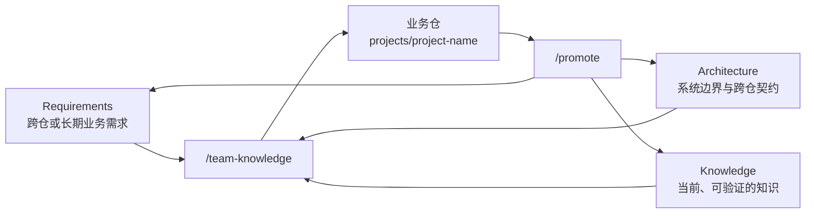

# Saber

Saber 是团队共享 Skills 与知识的工作区。

## 知识图谱



开始非简单任务时，用 `/team-knowledge` 读取与当前任务相关的共享资产；完成并验证工作后，成员可用
`/promote` 将可复用的结论归档到相应位置。

## 快速开始

前提：Node.js 20+。

```bash
mkdir team-knowledge
cd team-knowledge

# 首次执行会初始化当前目录
npm install -g @codehero0x0/saber
saber setup
```

目录名可以按团队习惯命名；首次 `setup` 会生成 `saber.yaml`、`requirements/`、`architecture/`、
`knowledge/`、`skills/`、`projects/` 和运行目录，并写入默认的 Skill 列表。

接着在 `saber.yaml` 配置业务仓 Git 地址：

```yaml
projects:
  - name: frontend
    path: projects/frontend
    repository: git@github.com:your-org/frontend.git
  - name: backend
    path: projects/backend
    repository: https://github.com/your-org/backend.git
```

再次执行 `saber setup`：缺失的项目会自动 clone 到 `projects/<name>`，并在每个项目中创建
`.agents/skills`、`.claude/skills`、`.opencode/skills`，将团队 Skills 链接进去。

## 用法

### 更新团队 Skills

在团队知识目录修改 `saber.yaml` 后执行：

```bash
saber setup
```

- `projects`：团队要接入的业务仓路径及可选的 `repository` Git 地址。
- `skills.include`：团队要分发的上游 Skill 列表。

### 在业务仓中工作

进入具体业务仓并打开 AI 工具，按任务需要组合以下 Skill：

| 场景 | Skill |
| --- | --- |
| 读取相关的团队需求、架构和知识 | `/team-knowledge` |
| 追问并澄清需求或方案 | `/grill-me` |
| 基于资料讨论方案 | `/grill-with-docs` |
| 形成可实施的规格 | `/to-spec` |
| 拆分工作项 | `/to-tickets` |
| 进行实现 | `/implement` |
| 测试驱动实现 | `/tdd` |
| 补充或校准领域模型 | `/domain-modeling` |
| 审查变更 | `/code-review` |

例如，需求尚不清楚时可以使用 `/grill-me` 和 `/to-spec`；实现前可先调用
`/team-knowledge`，再按需要使用 `/implement`、`/tdd` 与 `/code-review`。

### 沉淀团队知识

业务仓中的详细 spec、design、plan、`CONTEXT.md` 和 ADR 用于当前工作。需要共享的结论由成员明确发起：

1. 完成并验证业务仓改动。
2. 调用 `/promote`，将可复用结论整理为 Requirement、Architecture 或 Knowledge 摘要。
3. 人工 review 本地 Saber commit，再由成员决定如何提交共享。

同一主题的新证据应更新对应的当前 Knowledge 卡；历史由 Saber 仓库保留。
